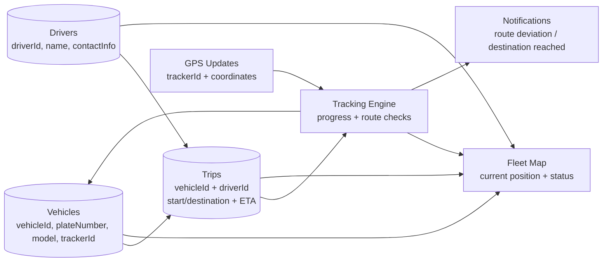

# Real-Time Fleet Tracking Flow

```mermaid
flowchart LR
  V[(Vehicles\nvehicleId, plateNumber, model, trackerId)]
  D[(Drivers\ndriverId, name, contactInfo)]
  T[(Trips\nvehicleId + driverId\nstart/destination + ETA)]
  GPS[GPS Updates\ntrackerId + coordinates]
  SIM[Tracking Engine\nprogress + route checks]
  N[Notifications\nroute deviation / destination reached]
  MAP[Fleet Map\ncurrent position + status]

  V --> T
  D --> T
  T --> SIM
  GPS --> SIM
  SIM --> V
  SIM --> MAP
  SIM --> N
  T --> MAP
  V --> MAP
  D --> MAP
```
